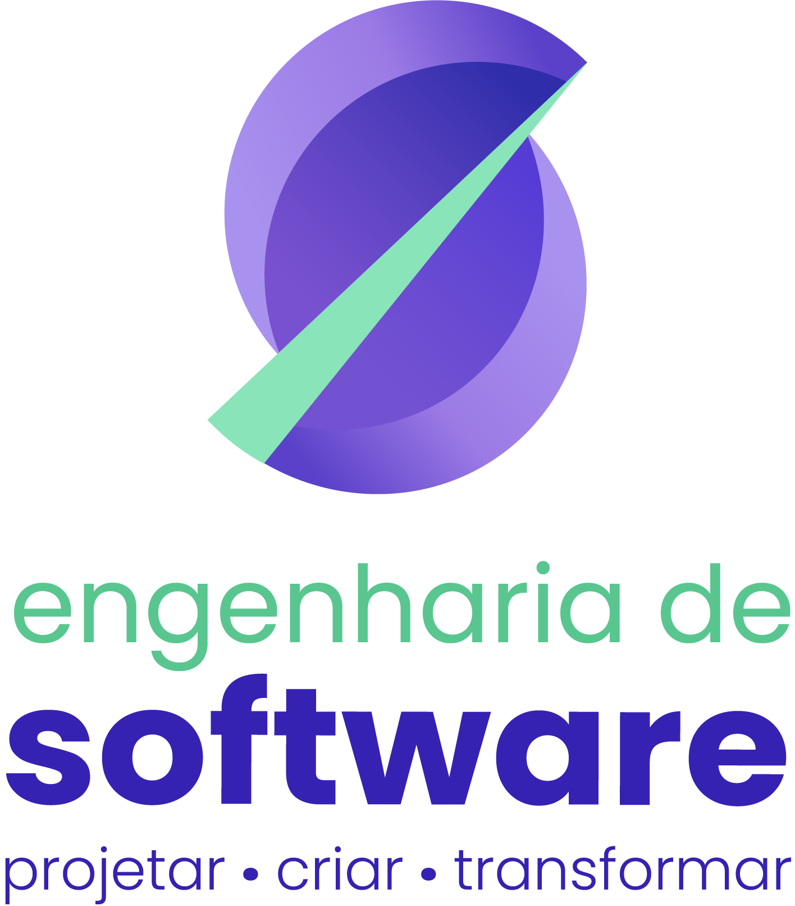
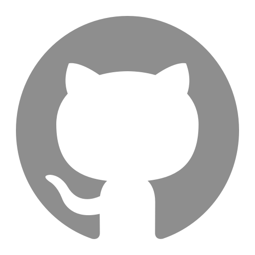
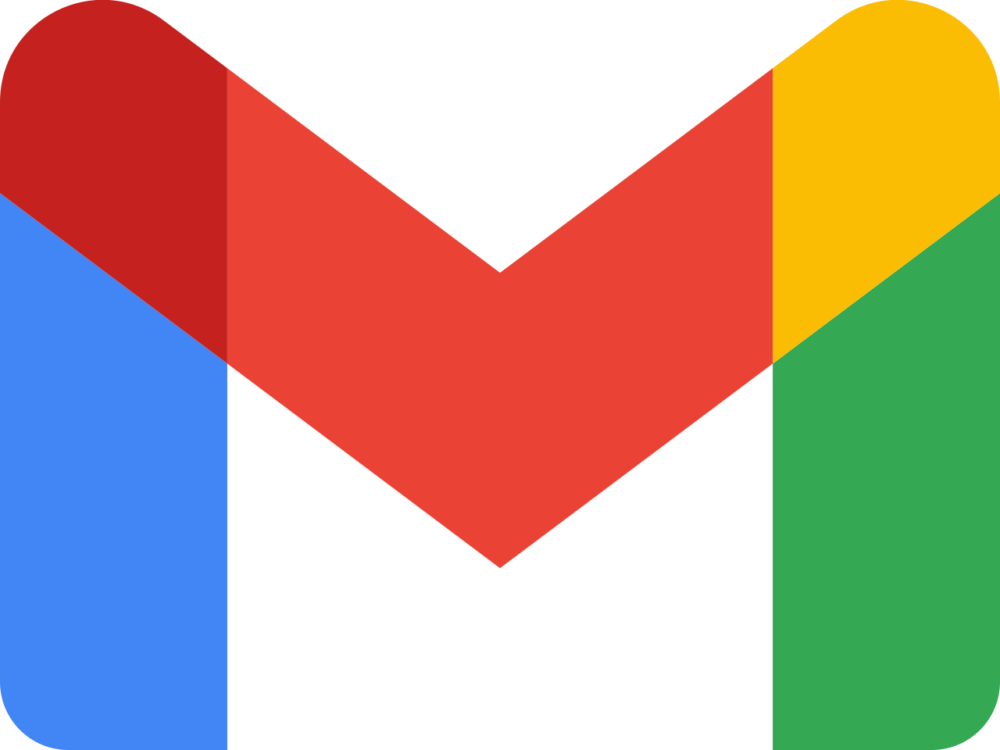

# 💻 Bernardo Guedes | Portfólio Profissional

<table>
  <tr>
    <td width="800">
      <div align="justify">
        Um portfólio pessoal desenvolvido com React e Vite para apresentar meus projetos, habilidades técnicas e trajetória profissional como estudante de Engenharia de Software e desenvolvedor em formação. O projeto busca oferecer uma experiência moderna, responsiva e interativa, com temas claro e escuro, elementos animados, uma seção dedicada aos projetos com links para seus repositórios no GitHub e acesso fácil aos perfis profissionais e às informações de contato. Além de servir como plataforma de apresentação profissional, este portfólio também é uma oportunidade de aprofundar meus conhecimentos em desenvolvimento front-end, explorar tecnologias web modernas e aplicar boas práticas de engenharia de software, aprimorando continuamente minhas habilidades.
      </div>
    </td>
    <td width="150" align="center">
      <div>
        
      </div>
    </td>
  </tr>
</table>

[](https://github.com/Bernardo-Guedes/portfolio/releases)          

---

## 📚 Índice
- [Links Úteis](#-links-úteis)
- [Sobre o Projeto](#-sobre-o-projeto)
- [Funcionalidades Principais](#-funcionalidades-principais)
- [Tecnologias Utilizadas](#-tecnologias-utilizadas)
- [Estrutura de Pastas Atual](#-estrutura-de-pastas-atual)
- [Protótipos](#-protótipos)
- [Autor](#-autor)
- [Agradecimentos](#-agradecimentos)
- [Licença](#-licença)

---

## 🔗 Links Úteis
* 🎨 **Protótipo Interativo:** [Acesse o protótipo no Figma](https://www.figma.com/proto/CX8ojhktk4RutVjwMLo7To/Prot%C3%B3tipo-Portf%C3%B3lio?node-id=1-2&p=f&t=LAfmYCIotEAkYZTd-0&scaling=min-zoom&content-scaling=fixed&page-id=0%3A1&starting-point-node-id=1%3A2&show-proto-sidebar=1)
  > **Descrição:** Link para o protótipo interativo do portfólio.
* 🌐 **Aplicação na Web:** Disponível ao final da Sprint 3
  > **Descrição:** A aplicação estará hospedada e disponível ao final da Sprint 3 de desenvolvimento
* 🌐 **Repositório:** [Bernardo-Guedes/portfolio](https://github.com/Bernardo-Guedes/portfolio)
  > **Descrição:** Repositório do projeto no GitHub
---

## 📝 Sobre o Projeto

Este portfólio nasceu da necessidade de reunir em um só lugar a minha trajetória como estudante de Engenharia de Software: projetos, experiências, habilidades técnicas e formas de contato. Em vez de depender apenas de um currículo em PDF ou de perfis espalhados em diferentes plataformas, a ideia é oferecer uma apresentação profissional, organizada e fácil de navegar para recrutadores, professores e outros desenvolvedores.

O projeto foi desenvolvido no contexto acadêmico da **PUC Minas**, mas com foco em uso real: ele serve como minha vitrine profissional e pode ser compartilhado em processos seletivos, candidaturas a estágio e networking. O visitante encontra rapidamente quem sou, o que já construí (com links para os repositórios no GitHub) e como falar comigo.

Além de apresentar meu trabalho, o portfólio também é um projeto de aprendizado. Ele me permite aprofundar conhecimentos em desenvolvimento front-end, explorar tecnologias modernas como React, TypeScript, Vite e Tailwind CSS, e aplicar boas práticas de engenharia de software, como documentação, versionamento, prototipação no Figma e organização de código, melhorando minhas habilidades a cada versão.

---

## ✨ Funcionalidades Principais

- **Sobre mim:** apresentação pessoal com informações sobre minha trajetória, formação, interesses e objetivos profissionais.
- **Experiências:** lista de experiências com organização, cargo, período e descrição.
- **Timeline de projetos:** projetos em ordem cronológica, com descrição, tecnologias, link do GitHub e imagem ou GIF.
- **Stack e ferramentas:** seção com as tecnologias, linguagens e ferramentas que utilizo.
- **Formulário de contato:** nome, e-mail e mensagem, com validação e envio por e-mail via EmailJS.
- **Links de contato:** ícones clicáveis para e-mail, LinkedIn e GitHub.
- **Bilíngue (PT/EN):** conteúdo em português e inglês, com alternância na barra superior.
- **Tema claro e escuro:** alternância pela barra superior.
- **Responsivo:** adaptado a telas de diversos dispositivos.
- **Interface animada:** elementos com animações para uma navegação mais fluida e interativa.
---

## 🛠 Tecnologias Utilizadas

### 💻 Front-end

* **Biblioteca:** [React](https://react.dev/)
* **Linguagem:** [TypeScript](https://www.typescriptlang.org/)
* **Build Tool:** [Vite](https://vite.dev/)
* **Estilização:** [Tailwind CSS](https://tailwindcss.com/)
* **Ícones:** [Lucide](https://lucide.dev/)
* **Internacionalização (PT/EN):** [i18next](https://www.i18next.com/) e [react-i18next](https://react.i18next.com/)

### 🖥️ Dados e Serviços

O projeto não tem back-end próprio. Os serviços externos são:

* **Banco de dados:** [Supabase](https://supabase.com/)
* **Envio de e-mail (formulário de contato):** [EmailJS](https://www.emailjs.com/)

### ⚙️ Infraestrutura e Ferramentas

* **Containerização (execução local):** [Docker](https://www.docker.com/) e Docker Compose
* **Hospedagem:** [Vercel](https://vercel.com/)
- **Análise estática:** [ESLint](https://eslint.org/docs/latest/)
* **Protótipos:** [Figma](https://www.figma.com/)
* **Versionamento:** [Git](https://git-scm.com/) e [GitHub](https://github.com/)

---

## 📂 Estrutura de Pastas Atual

```text
.
├── docs/                         # 📚 Documentação do projeto.
│   ├── prototype/                # 🎨 Telas do protótipo do portfólio.
│   └── images/                   # 🖼️ Imagens da documentação.
│
├── node_modules/                 # 📦 Dependências instaladas pelo npm.
│
├── public/                       # 🌐 Arquivos públicos acessíveis diretamente.
│
├── src/                          # 💻 Código-fonte da aplicação React.
│   ├── assets/                   # 🖼️ Recursos estáticos utilizados no projeto.
│   ├── App.css                   # 🎨 Estilos do componente principal.
│   ├── App.tsx                   # ⚛️ Componente principal da aplicação.
│   ├── index.css                 # 🎨 Estilos globais da aplicação.
│   └── main.tsx                  # 🚀 Ponto de entrada da aplicação React.
│
├── .gitignore                    # 🚫 Arquivos e pastas ignorados pelo Git.
├── eslint.config.js              # ✨ Configurações e regras do ESLint.
├── index.html                    # 🌐 Documento HTML principal da aplicação.
├── LICENSE                       # ⚖️ Licença do projeto
├── package-lock.json             # 🔒 Registro das versões das dependências.
├── package.json                  # 📦 Dependências, scripts e metadados do projeto.
├── README.md                     # 📘 Documentação principal do projeto.
├── tsconfig.app.json             # ⚙️ Configurações TypeScript da aplicação.
├── tsconfig.json                 # ⚙️ Configuração geral do TypeScript.
├── tsconfig.node.json            # ⚙️ Configurações TypeScript para ferramentas Node.js.
└── vite.config.ts                # ⚡ Configurações do Vite.
```


---

## 🎨 Protótipos

| Página Inicial | Página Sobre |
|----------------|----------------|
|  |  |

| Página Experiências | Página Projetos |
|----------------|----------------|
|  |  |

| Página Stack e Ferramentas | Página Contatos |
|----------------|----------------|
|  |  |

| Página Inicial - Tema Claro | Página Sobre - Tema Claro |
|----------------|----------------|
|  |  |

| Página Inicial | Página Sobre | Página Experiências| Página Projetos |
|----------------|----------------|----------------|----------------|
|  |  |  |  |

---

## 🔗 Documentações utilizadas

- 📖 **Framework/Biblioteca (Front-end):** [Documentação Oficial do React](https://react.dev/)
- 📖 **Build Tool (Front-end):** [Guia de Configuração do Vite](https://vite.dev/guide/)
- 📖 **Linguagem de Programação:** [Documentação Oficial do TypeScript](https://www.typescriptlang.org/docs/)
- 📖 **Estilização (CSS):** [Documentação Oficial do Tailwind CSS](https://tailwindcss.com/docs)
- 📖 **Ícones (Interface):** [Documentação Oficial do Lucide React](https://lucide.dev/guide/packages/lucide-react)
- 📖 **Roteamento (Front-end):** [Documentação Oficial do React Router](https://reactrouter.com/)
- 📖 **Internacionalização (i18n):** [Documentação do react-i18next](https://react.i18next.com/)
- 📖 **Backend as a Service (BaaS):** [Documentação Oficial do Supabase](https://supabase.com/docs)
- 📖 **Envio de E-mails:** [Documentação Oficial do EmailJS](https://www.emailjs.com/docs/)
- 📖 **Containerização:** [Documentação de Referência do Docker](https://docs.docker.com/)
- 📖 **Hospedagem e Deploy:** [Documentação Oficial da Vercel](https://vercel.com/docs)

---

## 👥 Autor

| Nome | Foto | GitHub | LinkedIn | Gmail |
|---------|----------|-----------------|-------------|-----------|
| Bernardo Guedes  | <div align="center"></div> | <div align="center"><a href="https://github.com/Bernardo-Guedes"></a></div> | <div align="center"><a href="https://www.linkedin.com/in/bernardoguedes"></a></div> | <div align="center"><a href="mailto:bguedessilveira@gmail.com"></a></div> |

---

## 🙏 Agradecimentos

Gostaria de agradecer aos seguintes canais e pessoas que foram fundamentais para o desenvolvimento deste projeto:

* [**Engenharia de Software PUC Minas**](https://www.instagram.com/engsoftwarepucminas/) - Pelo apoio institucional, estrutura acadêmica e fomento à inovação e boas práticas de engenharia.
* [**Prof. Dr. João Paulo Aramuni**](https://github.com/joaopauloaramuni) - Pelos valiosos ensinamentos sobre **Arquitetura de Software** e **Padrões de Projeto**.

---

## 📄 Licença

Este projeto é distribuído sob a **[Licença MIT](https://github.com/Bernardo-Guedes/portfolio/blob/main/LICENSE)**.

---